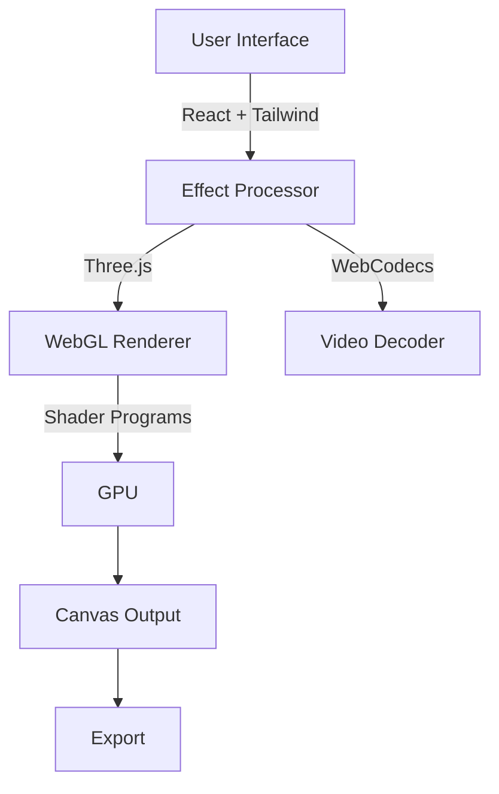

# Grain Effects

> A browser-based image processing tool featuring ASCII art, dithering, and retro CRT effects. Built with [[WebGL]], [[Three.js]], and [[React]].

## Quick Links

- [[01 - Architecture Overview|Architecture Overview]] - System design and component relationships
- [[02 - Shader Effects Guide|Shader Effects Guide]] - Deep dive into each visual effect
- [[03 - Dithering Algorithms|Dithering Algorithms]] - How dithering works mathematically
- [[04 - ASCII Art Rendering|ASCII Art Rendering]] - Procedural character generation
- [[05 - Development Setup|Development Setup]] - Getting started with the codebase
- [[06 - Adding New Effects|Adding New Effects]] - Extending the system
- [[07 - Performance Optimization|Performance Optimization]] - Making it run at 60fps
- [[08 - WebCodecs Integration|WebCodecs Integration]] - Video processing (planned)

## What This Project Does

This project recreates the functionality of [grainrad.com](https://grainrad.com/) - a tool that applies real-time visual effects to images and videos entirely in the browser using GPU acceleration.

### Supported Effects

| Effect | Description |
|--------|-------------|
| [[02 - Shader Effects Guide#ASCII\|ASCII Art]] | Converts images to text characters based on brightness |
| [[02 - Shader Effects Guide#Dithering\|Dithering]] | Reduces color depth while preserving perceived detail |
| [[02 - Shader Effects Guide#Pixelation\|Pixelation]] | Reduces resolution for retro aesthetics |
| [[02 - Shader Effects Guide#CRT\|CRT Monitor]] | Simulates old television/monitor effects |
| [[02 - Shader Effects Guide#Noise\|Film Grain]] | Adds analog noise and animation |

### Supported Formats

- **Images**: PNG, JPG, GIF, WebP
- **Video**: MP4, WebM, MOV
- **3D**: GLB, GLTF (basic support)

## Key Technologies



1. **[[WebGL]]** - GPU-accelerated rendering
2. **[[Three.js]]** - 3D library for scene management
3. **[[React]]** - UI framework
4. **[[Tailwind CSS]]** - Utility-first styling
5. **[[TypeScript]]** - Type-safe JavaScript

## Project Philosophy

### Why Shaders?

Traditional image processing in JavaScript is slow because it processes pixels one-by-one on the CPU. [[Shaders]] run on the GPU and can process thousands of pixels in parallel, enabling real-time 60fps effects even on high-resolution video.

### Why In The Browser?

- **No installation required** - Works on any device with a modern browser
- **Privacy** - All processing happens locally, images never leave your device
- **Shareable** - Send someone a link, they can use it immediately
- **Cross-platform** - Windows, Mac, Linux, mobile - all supported

## Learning Path

### For Beginners

Start here if you're new to graphics programming:

1. Read [[03 - Dithering Algorithms]] - Understand the simplest effect
2. Try modifying the [[02 - Shader Effects Guide#Pixelation\|pixel size]] in the shader
3. Experiment with changing colors in the [[04 - ASCII Art Rendering|ASCII shader]]

### For Experienced Developers

1. Review [[01 - Architecture Overview]] - See how components connect
2. Study [[07 - Performance Optimization]] - Learn GPU optimization techniques
3. Follow [[06 - Adding New Effects]] - Build your own effect

## Code Organization

```
src/
├── components/          # React UI components
│   ├── FileDropzone.tsx
│   └── ControlPanel.tsx
├── engine/             # Core processing engine
│   └── EffectProcessor.ts
├── shaders/            # GLSL shader programs
│   ├── dithering.ts
│   ├── ascii.ts
│   └── retro.ts
├── App.tsx            # Main application
└── main.tsx           # Entry point
```

## Glossary

- **[[Fragment Shader]]** - GPU program that calculates pixel colors
- **[[Uniform]]** - Input variable passed from JavaScript to shader
- **[[UV Coordinates]]** - 2D texture coordinates (0,0 to 1,1)
- **[[Luminance]]** - Perceived brightness of a color
- **[[Quantization]]** - Reducing number of colors

## References

- [The Book of Shaders](https://thebookofshaders.com/)
- [Three.js Documentation](https://threejs.org/docs/)
- [WebGL Fundamentals](https://webglfundamentals.org/)
- [Codrops Shader Tutorials](https://tympanus.net/codrops/)

## License

MIT - Feel free to use this code for learning or building your own projects!
