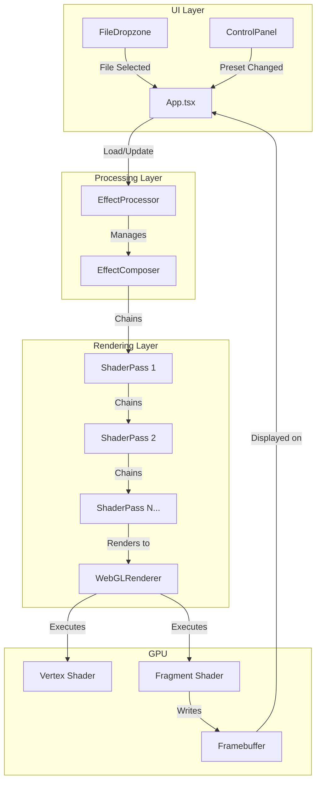
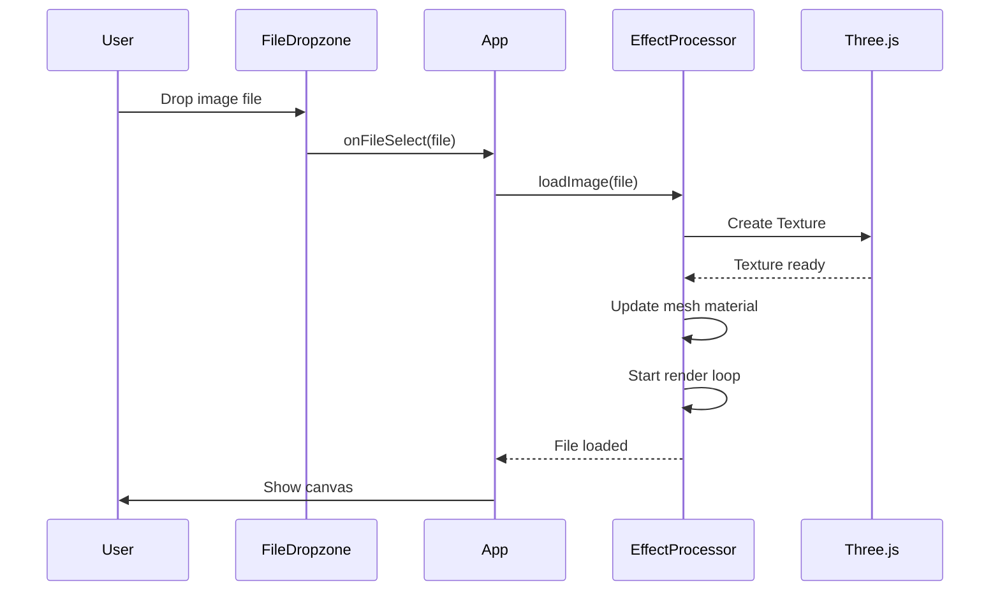
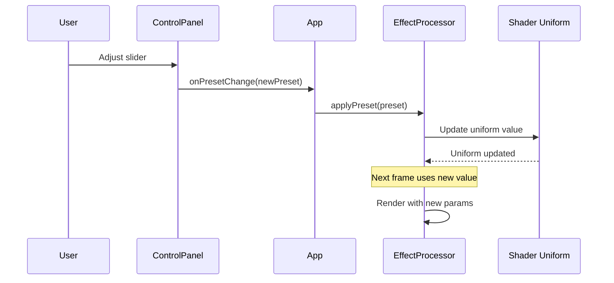
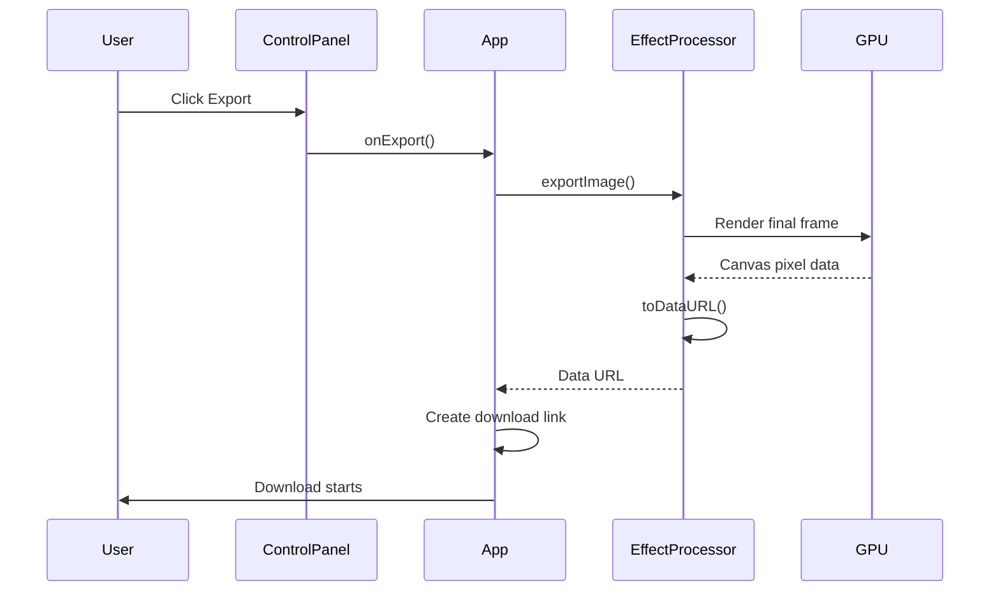

# Architecture Overview

This document explains how the different parts of the grain effects system work together.

## System Architecture



## Component Breakdown

### 1. UI Layer (`src/components/`)

#### FileDropzone
- Handles drag-and-drop file input
- Validates file types
- Triggers file loading

```typescript
// Key interaction
onDrop = (file) => {
  processor.loadImage(file)
}
```

#### ControlPanel
- Displays effect parameters
- Emits changes to App
- Uses sliders, toggles, color pickers

### 2. Processing Layer (`src/engine/`)

#### EffectProcessor
The core orchestrator that manages the entire rendering pipeline.

**Responsibilities:**
- Initialize [[Three.js]] scene
- Manage effect chain
- Load media (images/videos)
- Apply presets
- Handle exports

```typescript
class EffectProcessor {
  // Scene setup
  private scene: THREE.Scene
  private camera: THREE.OrthographicCamera
  private renderer: THREE.WebGLRenderer
  
  // Effect chain
  private composer: EffectComposer
  private passes: ShaderPass[]
  
  // Public API
  async loadImage(file)
  applyPreset(preset)
  exportImage()
}
```

#### EffectComposer
Manages a chain of post-processing effects:

```
Input Texture → Pass 1 → Pass 2 → ... → Pass N → Output
```

Each pass reads from the previous pass's output and writes to the next.

### 3. Rendering Layer (`src/shaders/`)

Each effect is implemented as a [[ShaderPass]] containing:

- **Vertex Shader**: Transforms geometry (usually just passes UVs through)
- **Fragment Shader**: Calculates final pixel color
- **Uniforms**: Configurable parameters

Example effect chain:

```
Original Image → Pixelate → Dither → ASCII → CRT → Final Output
```

## Data Flow

### Loading an Image



### Changing an Effect Parameter



### Exporting an Image



## Key Design Decisions

### 1. Why Post-Processing?

Instead of applying effects during initial rendering, we render to an offscreen buffer first, then apply effects as a post-process. This allows:

- **Chain effects** - Output of one effect becomes input to next
- **Reorder effects** - Change order without rewriting shaders
- **Toggle effects** - Enable/disable without recompiling

### 2. Why Orthographic Camera?

For image processing, we don't need 3D perspective. An orthographic camera maps pixels 1:1, simplifying UV calculations.

```
Orthographic:   Perspective:
┌─────────┐     ╱        ╲
│ ╲     ╱ │    ╱  ╲    ╱  ╲
│   ╲ ╱   │   ╱    ╲  ╱    ╲
│    ●    │  ●──────────────●
│   ╱ ╲   │
│ ╱     ╲ │
└─────────┘
(No distortion)  (3D perspective)
```

### 3. Why Uniforms for Parameters?

Shaders are compiled once, but uniforms can change every frame. This enables:
- Real-time parameter adjustment
- Animation (time-based effects)
- Smooth transitions

### 4. Why PreserveDrawingBuffer?

WebGL clears the canvas after each frame by default. `preserveDrawingBuffer: true` keeps the data so we can export it.

## State Management

There's minimal global state:

```typescript
// App.tsx state
const [preset, setPreset] = useState<EffectPreset>(...)
const [hasFile, setHasFile] = useState(false)

// Everything else is local to components
// or managed by Three.js internally
```

This keeps the architecture simple and predictable.

## Performance Considerations

### Frame Budget

At 60fps, each frame has ~16ms to complete:

```
Budget: 16.67ms
├── JavaScript:  < 5ms
│   ├── Update uniforms: 0.1ms
│   └── Event handling:  variable
├── GPU Rendering: < 10ms
│   ├── Pass 1: 2ms
│   ├── Pass 2: 2ms
│   ├── Pass 3: 2ms
│   └── Present: 1ms
└── Browser overhead: ~2ms
```

### Resolution Scaling

High-resolution images can cause frame drops. The canvas automatically scales to fit the container while maintaining aspect ratio.

### Texture Management

```typescript
// When loading a new image:
if (this.texture) {
  this.texture.dispose()  // Free GPU memory
}
this.texture = newTexture  // Assign new
```

Always dispose old textures to prevent memory leaks.

## Extension Points

### Adding a New Effect

1. Create shader in `src/shaders/myEffect.ts`
2. Add pass in `EffectProcessor.ts` constructor
3. Add controls in `ControlPanel.tsx`
4. Update `EffectPreset` interface

See [[06 - Adding New Effects]] for detailed instructions.

### Adding Video Support

Currently basic video support exists. Full WebCodecs integration would:

1. Decode video frames using [[WebCodecs API]]
2. Upload each frame as texture
3. Apply effects
4. Encode output frames

See [[08 - WebCodecs Integration]] for the implementation plan.

## Troubleshooting

### Black Screen

- Check WebGL support: `console.log(renderer.capabilities)`
- Verify texture loaded: `console.log(texture.image)`
- Check shader compilation errors in browser console

### Low FPS

- Reduce canvas resolution
- Disable expensive effects (CRT curvature)
- Check for memory leaks with Chrome DevTools

### Export is Black

- Ensure `preserveDrawingBuffer: true` in renderer
- Call `composer.render()` before `toDataURL()`

## Further Reading

- [[02 - Shader Effects Guide]] - How each effect works
- [[07 - Performance Optimization]] - Profiling and optimization
- Three.js Post-Processing Guide: https://threejs.org/docs/#manual/en/introduction/How-to-use-post-processing
