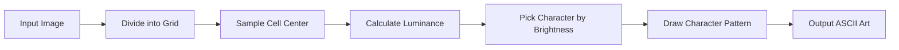
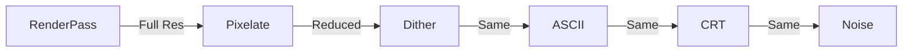

# Shader Effects Guide

This guide explains how each visual effect works, both conceptually and in code.

## Table of Contents

- [[#Dithering|Dithering]] - Creating illusion of more colors
- [[#ASCII|ASCII Art]] - Converting images to text
- [[#Pixelation|Pixelation]] - Reducing resolution
- [[#CRT|CRT Monitor]] - Old television simulation
- [[#Noise|Noise]] - Film grain and analog artifacts
- [[#Effect Chaining|Effect Chaining]] - Combining effects

---

## Dithering

Dithering is a technique to create the illusion of color depth by diffusing pixels of available colors.

### Visual Example

```
Without Dithering:     With Dithering:
███████████████        ████░░░░████░░░
██░░░░░░░░░░░██        █░██░░██░░██░░
██░░░░░░░░░░░██   →    ░░██░░░░██░░██
██░░░░░░░░░░░██        ░██░░██░░██░░░
███████████████        ████░░░░████░░
(Band artifacts)       (Smooth gradient)
```

### Bayer Ordered Dithering

The most GPU-friendly approach using a pre-computed threshold matrix.

```glsl
// 4x4 Bayer matrix
float bayerMatrix4x4(vec2 coord) {
  int x = int(mod(coord.x, 4.0));
  int y = int(mod(coord.y, 4.0));
  int index = x + y * 4;
  
  // Returns threshold value 0.0 to 1.0
  // Based on position in the matrix
}
```

**How it works:**
1. Calculate pixel's luminance (brightness)
2. Look up threshold from Bayer matrix based on position
3. Add threshold to luminance
4. Quantize to available color levels

**Key Code:**
```glsl
float luma = dot(color.rgb, vec3(0.2126, 0.7152, 0.0722));
float threshold = bayerMatrix4x4(pixelCoord) - 0.5;
float dithered = luma + threshold * (1.0 / colorLevels);
float quantized = floor(dithered * colorLevels + 0.5) / colorLevels;
```

### Color Dithering

Extends Bayer dithering with color palettes:

```glsl
// Map luminance to palette index
int index = int(clamp(ditheredLuma * (paletteSize - 1.0), 0.0, paletteSize - 1.0));
vec3 finalColor = palette[index];
```

**Available Palettes:**
- **Game Boy**: Classic 4-green palette
- **C64**: Commodore 64 16-color palette
- **CGA**: Classic PC 4-color
- **Amber/Green**: Monochrome monitor simulation

---

## ASCII

Converts images to ASCII art by drawing text characters procedurally.

### The Challenge

Shaders can't render text. The solution is **procedural character generation** - drawing each character pixel by pixel using math.

### Character Grid System

```
Each ASCII character lives on a 5×7 grid:

  0 1 2 3 4  (X)
0 . . # . .
1 . . # . .
2 # # # # #
3 . . # . .
4 . . # . .
5 . . . . .
6 . . # . .

(Y)

"+" = specific pixels turned on
```

### Procedural Character Drawing

```glsl
float getCharPattern(float charIndex, vec2 gridPos) {
  // gridPos is 0-4 in X, 0-6 in Y
  
  if (charIndex < 0.5) {
    // Space (darkest)
    return 0.0;
  }
  else if (charIndex < 1.5) {
    // Period '.'
    return (row == 5.0 && col == 2.0) ? 1.0 : 0.0;
  }
  else if (charIndex < 2.5) {
    // Plus '+'
    return ((row == 3.0 && col >= 1.0 && col <= 3.0) ||
            (col == 2.0 && row >= 2.0 && row <= 4.0)) ? 1.0 : 0.0;
  }
  // ... more characters
}
```

### The Algorithm



**Key Code:**
```glsl
// Cell coordinates
vec2 cellCount = resolution / cellSize;
vec2 cellUv = floor(vUv * cellCount) / cellCount;
vec2 cellFract = fract(vUv * cellCount);

// Sample and calculate brightness
vec4 cellColor = texture2D(tDiffuse, cellUv + 0.5 / cellCount);
float luma = dot(cellColor.rgb, vec3(0.2126, 0.7152, 0.0722));

// Map to character
float charIndex = floor(luma * (characters - 1.0) + 0.5);

// Draw character
vec2 gridPos = cellFract * vec2(5.0, 7.0);
float pattern = getCharPattern(charIndex, gridPos);
```

### Character Ramp

Characters ordered from darkest to lightest:
```
' .:-=+*#%@'
 │ │ │ │ │ │ │ │ │ │
 │ │ │ │ │ │ │ │ │ └─ Brightest (largest filled area)
 │ │ │ │ │ │ │ │ └── High density
 │ │ │ │ │ │ │ └──── Medium-high
 │ │ │ │ │ │ └────── Medium
 │ │ │ │ │ └──────── Medium-low
 │ │ │ │ └────────── Low
 │ │ │ └──────────── Very low
 │ │ └────────────── Minimal
 │ └──────────────── Tiny dot
 └────────────────── Empty
```

---

## Pixelation

The simplest effect - reduces effective resolution.

### The Math

```glsl
// Normal pixel coordinate: continuous 0.0 to 1.0
// Pixelated: snapped to grid

vec2 pixelSizeUv = pixelSize / resolution;
vec2 uvPixel = pixelSizeUv * floor(vUv / pixelSizeUv);
```

### Visual Breakdown

```
Before (smooth):      After (pixelated):
0.0 0.1 0.2 0.3...    0.0 0.0 0.0 0.2 0.2 0.2 0.4...
│  │  │  │            │──────│  │──────│

UV coordinates:       Snapped to grid:
0.1 → 0.0            
0.15 → 0.0           (all fall in first cell)
0.2 → 0.2            (next cell boundary)
0.25 → 0.2
```

### Use Cases

- Retro game aesthetics
- Privacy (blur faces)
- Performance (process fewer effective pixels)
- Style (abstract art)

---

## CRT

Simulates old CRT (Cathode Ray Tube) monitors/televisions.

### Components

#### 1. Scanlines

Horizontal lines that were visible on CRTs due to the electron beam scanning pattern.

```glsl
float scanline = sin(uv.y * scanlineCount * 3.14159) * 0.5 + 0.5;
scanline = 1.0 - (scanline * scanlineIntensity);
color.rgb *= scanline;
```

Visual:
```
Normal:           With Scanlines:
████████████      ████████████
████████████      ────────────
████████████  →   ████████████
████████████      ────────────
████████████      ████████████
```

#### 2. Vignette

Darkening at screen edges due to CRT glass curvature and light falloff.

```glsl
vec2 centered = uv - 0.5;
float dist = length(centered);
float vignette = 1.0 - dist * vignetteIntensity;
color.rgb *= vignette;
```

#### 3. Curvature

Barrel distortion from the curved CRT glass.

```glsl
vec2 curveUV(vec2 uv, float amount) {
  vec2 centered = uv - 0.5;
  float dist = length(centered);
  float distortion = 1.0 + amount * dist * dist;
  return centered * distortion + 0.5;
}
```

---

## Noise

Adds film grain or analog signal noise.

### Types of Noise

#### 1. White Noise
```glsl
float random(vec2 st) {
  return fract(sin(dot(st.xy, vec2(12.9898, 78.233))) * 43758.5453123);
}
```

#### 2. Smooth Noise (Perlin-like)
```glsl
float noise(vec2 st) {
  vec2 i = floor(st);
  vec2 f = fract(st);
  
  // Four corners
  float a = random(i);
  float b = random(i + vec2(1.0, 0.0));
  float c = random(i + vec2(0.0, 1.0));
  float d = random(i + vec2(1.0, 1.0));
  
  // Smooth interpolation
  vec2 u = f * f * (3.0 - 2.0 * f);
  
  return mix(a, b, u.x) + (c - a)*u.y*(1.0 - u.x) + (d - b)*u.x*u.y;
}
```

### Animation

```glsl
// Static noise
float n = noise(uv * scale);

// Animated noise
float n = noise(uv * scale + time * speed);
```

---

## Effect Chaining

The power of this system comes from combining effects.

### Pipeline Order

```
Input → Pixelate → Dither → ASCII → CRT → Noise → Output
        ────────   ──────   ─────   ───   ─────
        Resolution Colors   Text    TV    Film
        Reduction  Palette  Layout  Look  Grain
```

### Order Matters

Different orders produce different results:

```
Pixelate → Dither → ASCII:
  1. Reduce resolution
  2. Apply color dithering to pixels
  3. Convert to ASCII
  Result: Large ASCII characters

Dither → Pixelate → ASCII:
  1. Dither at full resolution
  2. Then pixelate
  3. Then ASCII
  Result: Small ASCII with dithered colors
```

### Performance Chain



Early pixelation reduces the effective resolution for subsequent passes, improving performance.

---

## Shader Uniforms Reference

### Dithering
| Uniform | Type | Range | Description |
|---------|------|-------|-------------|
| `enable` | bool | true/false | Toggle effect |
| `colorLevels` | float | 2-16 | Number of output colors |
| `scale` | float | 0.5-4.0 | Pattern scale multiplier |

### ASCII
| Uniform | Type | Range | Description |
|---------|------|-------|-------------|
| `enable` | bool | true/false | Toggle effect |
| `cellSize` | float | 4-32 | Pixels per ASCII character |
| `color` | vec3 | 0-1 | Character color (RGB) |
| `enableColor` | bool | true/false | Use source colors |

### Pixelate
| Uniform | Type | Range | Description |
|---------|------|-------|-------------|
| `enable` | bool | true/false | Toggle effect |
| `pixelSize` | float | 2-64 | Size of output pixels |

### CRT
| Uniform | Type | Range | Description |
|---------|------|-------|-------------|
| `enable` | bool | true/false | Toggle effect |
| `scanlineIntensity` | float | 0-1 | Darkness of lines |
| `vignetteIntensity` | float | 0-3 | Edge darkening |
| `enableCurvature` | bool | true/false | Barrel distortion |

---

## Further Reading

- [[03 - Dithering Algorithms]] - Mathematical deep dive
- [[04 - ASCII Art Rendering]] - More on procedural text
- [[07 - Performance Optimization]] - Making effects fast
